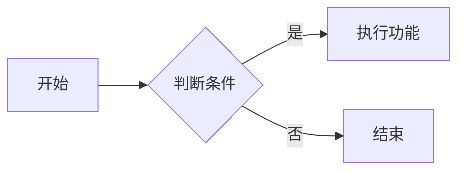

---
# Puppeteer PDF 导出完整格式配置
puppeteer:
  # 1. 纸张尺寸：A3/A4/A5/Legal/Tabloid/Letter
  format: "A4"
  # 2. 是否横向打印 false=纵向，true=横向
  landscape: false
  # 3. 是否打印背景（代码块深色主题、页面背景必须开启 true）
  printBackground: true
  # 4. 缩放比例 0.5 ~ 2.0
  scale: 1.0
  # 5. 页边距 单位 cm / mm / px
  margin:
    top: "1.2cm"
    bottom: "1.2cm"
    left: "1.5cm"
    right: "1.5cm"
  # 6. 渲染超时时间（Mermaid大图、复杂公式建议 8000~12000 毫秒）
  timeout: 10000
  # 7. 使用CSS定义的页面尺寸
  headerTemplate: |
    <div style="width:100%;text-align:center;font-size:12px;color:#333;font-weight:bold;border-bottom:1px solid #eee;padding-bottom:4px;">
      技术文档
    </div>
  # 页脚居中，带页码
  footerTemplate: |
    <div style="width:100%;text-align:center;font-size:10px;color:#666;padding-top:4px;">
      第 <span class='pageNumber'></span> 页 / 共 <span class='totalPages'></span> 页
    </div>
  preferCSSPageSize: true
  displayHeaderFooter: true

# 可选：保存md文件时自动导出PDF
export_on_save:
  puppeteer: ["pdf"]

# 目录配置（可选）
toc: true
toc_depth: 4
number_headings: true
---

<h1 style="text-align:center;">Markdown完整语法学习文档</h1>  

> 适用编辑器：VSCode、Typora、Github、语雀、掘金  
> 说明：左侧是源代码写法，预览窗口显示最终渲染效果  

## 目录

1. 标题语法
2. 文本样式
3. 换行、分割线、注释
4. 引用块 >
5. 列表：有序/无序/嵌套/任务复选框
6. 代码：行内代码、代码块、语法高亮
7. 链接、锚点、图片（本地图片+网络图片）
8. 表格（单元格对齐）
9. 特殊字符【重点：原意输出、转义】
10. 内嵌HTML（进阶自定义样式）
11. 扩展语法：脚注、公式、Mermaid图片（VSCode插件支持） 
12. 常见踩坑避坑清单 
</br>  

## 1. 标题语法

### 代码

```md
# 一级标题

## 二级标题

### 三级标题

#### 四级标题

##### 五级标题

###### 六级标题
```

### 渲染效果

> # 一级标题
>
> ## 二级标题
>
> ### 三级标题
>
> #### 四级标题
>
>##### 五级标题
>
>###### 六级标题

## 2.文本样式

### 代码

```md
- 斜体文字➡_示例文字_
- 加粗文字➡**示例文字**
- 加粗+斜体文字➡**_示例文字_**
- 删除线文字➡~~示例文字~~
- 高亮文字➡==示例文字==（VSCode支持）
- 下标➡H~2~O
- 上标➡E=mc^2
```

### 渲染效果

> _示例文字_
>
> **示例文字**
>
> **_示例文字_**
>
> ~~示例文字~~
>
> ==示例文字==
>
> H~2~O
>
> E=mc^2^
>
> <a id="anchor-rule"></a>
> 测试文本内锚点跳转

## 3.换行、分割线、注释

### 3.1换行

Markdown规则：

- 行末尾两个空格+回车：强制软换行
- 空一行：段落分隔（标准段落换行）

### 3.2分割线

#### 源代码

```md
添加分割线➡--- OR *** OR ___
```

#### 渲染效果

---

### 3.3注释

```md
<!-- 这段代码预览窗口看不到，只能保存在源码里 -->
```

## 4.引用块

### 源代码

```md
> 一级引用文本
>> 嵌套二级引用
>>> 多层嵌套引用

> 引用可以**混合其他markdown语法**
>*加粗文字*、`行内代码`
```

### 渲染结果

> 一级引用文本
>> 二级引用文本
>>> 多层嵌套引用

## 5.列表语法

### 5.1无序列表

```md
- 列表项目1
- 列表项目2
* 项目A
+ 项目B
```

### 5.2有序列表

```md
1. 第一项
2. 第二项
3. 第三项
```

### 5.3列表嵌套

```md
- 父级目录
  - 子条目1
  - 子条目2
1. 有序父项
  - 嵌套无序子项
  - [X] 已完成事项
  - [ ] 未完成事项  //GFM扩展语法
```

>❗方括号内前后保留空格

#### 应用示例

- 父级目录
  - 子条目1
  - 子条目2

1. 有序父项
   - 嵌套无序子项

- [x] 已完成事项
- [ ] 未完成事项

## 6.代码相关

> 该功能用于原文输出代码和转义字符，还可以通过配置文件来设置代码的高亮规则

### 6.1行内代码

```md
语法规则：`[你的代码或者特殊字符]`
执行命令：`npm install`
变量名称：`uer_id`
```

### 6.2围栏代码块

```md
语法规则：```[你的代码块]```
```

## 7.链接与图片

### 7.1普通超链接

#### 代码

```md
[显示文字](超链接 "鼠标悬浮显示标题")

[文档内部跳转](#标题锚点)
[打开本地文件](要打开的文件位置)
```

#### 实现效果

[百度](https://www.baidu.com "百度一下，你就知道")  
[文本内跳转](#anchor-rule)  
[打开本地文件](./.vscode/settings.json)

### 7.2图片

#### 代码

```md


```

#### 渲染结果


> 本体图片路径注意：./代表当前md文件同级目录

### 7.3图片+链接组合（点击图片跳转）

#### 代码

```md
[](跳转链接地址)
```

#### 渲染结果

[](https://w3cschool.fhb971.com/)

### 8.表格语法

#### 代码

```md
|姓名|岗位|薪资|
|:---|:---:|---:|
|张三|开发|10000|
|李四|产品|12000|
```

#### 渲染结果

|姓名|岗位|薪资|
|:---|:---:|---:|
|张三|开发|10000|
|李四|产品|12000|

> ⚠表格内单元格内部竖线\|需要转义写成\\|，否则会发生表格断裂！

### 9.特殊字符原样输出

Markdown有一批控制符号，直接写会触发格式，一共有三种合理处理方案：

#### 方案1：反斜杠转义\\(少量符号首选)

需要转义的符号清单:</br>
`\ * _ {} [] () # + - . ! | <>`

**示例：**

```md
\#不会变成标题
\*普通星号，不斜体
\[文字\]原样显示[文字]
```

#### 方案2：放入代码块中

**示例：**

````md
```
`* # [] () _ 全部原样展示
**加粗标记失效**
[链接文字](url)不会识别链接
```
````

#### 方案3：HTML实体编码（导出PDF文档绝对兼容）

```md
&lt; 代表<
&gt; 代表>
&amp; 代表&
```

### 10.内嵌HTML（自定义更复杂的格式）

Markdown原生不支持对字体、字号、行距等的调整，可以嵌入HTML进行实现：

#### 代码

```html
<p style="font-size:16px;line-height:1.8;color:#333;">
自定义文字大小、行间距
<strong>加粗文字</strong>
</p>

```

#### 渲染结果

<p style="font-size:16px;line-height:1.8;color:#333;">
自定义文字大小、行间距
<strong>加粗文字</strong>
</p>


### 11.进阶扩展语法

#### 11.1 注脚

**示例：**

```md
文本内容[^1] #注脚标注位置

[^1]: 底部注释内容
```

**结果：**

这篇文章是在**豆包**[^1]的帮助下完成的

[^1]:<p style="text-indent:0;">豆包是字节跳动旗下的自然语言人工智能大模型产品，日活跃用户接近一个亿。</p>

#### 11.2LaTex数学公式

**示例：**

```md
行内公式 $E=mc^2$

公式块

$$
\sum_{i=1}^n x_i
$$
```

**结果：**

$E=mc^2$

$$
\sum_{i=1}^n x_i
$$

#### 11.3 Mermaid流程图（绘制架构图）

**示例：**

````md

````

**结果：**


### 12.常见踩坑避坑清单

1. \# 和标题文字中间必须有空格
2. 任务清单 - [ ] 括号前后空格不能省略
3. 本地图片路径尽量使用相对路径 ./images/xxx，移动文件夹不容易失效
4. 想要符号原样展示，优先放进代码块，少手动逐个加反斜杠
5. 不同平台扩展语法支持不一致（高亮、下标、流程图在部分网站会失效），正式文档尽量只用【基础标准语法】
6. 不要混用中文全角符号逃避渲染，字符本身会改变

<div style="font-size:20px;font-weight:bold;">
<p>
最后，感谢豆包的技术协助，使我的Markdown熟练~
</p>
</div>

</br></br></br>